# wwand in LuCI — a visual tour

The LuCI web UI (`luci-app-wwand` + `luci-proto-wwand`) drives the whole
`/etc/config/network` model — every screen below writes the same config you
could edit by hand (see [reference.md](reference.md)).

ICCID / IMSI / IMEI / EID and the assigned addresses are masked in these
screenshots — a public IPv6 prefix identifies a subscriber line as surely as an
IMSI does. They are captured by `tools/luci-screenshot.py`, which stops the
one-second refresh, applies that masking and grabs the full page, so redoing
them after a UI change is one command and not an afternoon with an image
editor:

    tools/luci-screenshot.py --login root \
        --url http://ROUTER/cgi-bin/luci/admin/status/wwand \
        --out docs/images/luci-status-chateau.png

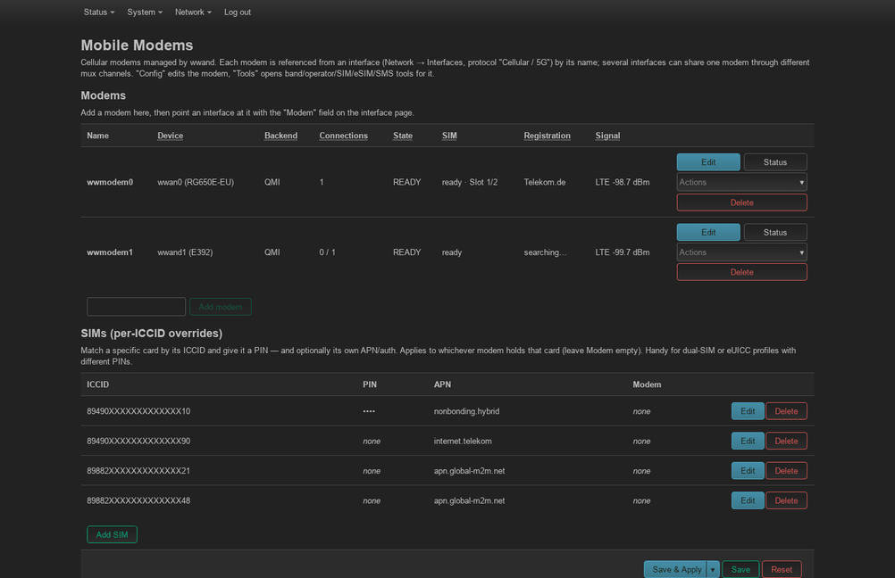

## Network → Modems — the overview

The entry point. Lists every managed **and** detected modem with live SIM and
registration status, its **backend** (QMI/MBIM/NCM) and the number of **up
connections** per modem, plus the per-ICCID SIM override table. Each row has
**Edit** (the modem), **Status**, **Delete** and an **Actions** menu: **Tools**,
**Reboot** — which resets just that modem (GPIO reset if the board exposes one,
otherwise a backend soft reset; its connections drop briefly and recover on
their own) — **Repower**, **Reattach** and, where they apply, **Unlock SIM**
and **Save SIM** (a per-ICCID entry for the inserted card).

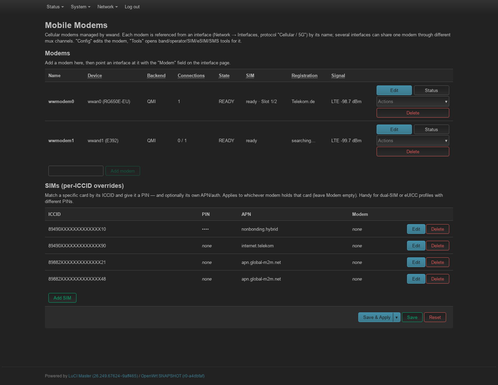

Below the SIM list, a **Migratable interfaces** section appears whenever the box
still has stock `proto qmi`/`mbim`/`ncm`/`modemmanager` interfaces that wwand
does not manage yet. Tick the ones to convert and press **Migrate selected**: each is rewritten
**in place** to `proto wwand` (its name, firewall zone and IP settings are kept)
and a `wwand_modem` section is created and linked — wwand then takes over managing
it. This is the recommended way to hand a stock cellular interface to wwand. For
an unattended one-shot conversion there is an example uci-defaults script in
`/usr/share/wwand/examples/` that runs the same migration at the next boot.

## Modem config

The per-modem dialog (Edit button). Hardware binding by **device path**
(a dropdown of detected modems + free text), USB serial or IMEI; the **FCC
unlock** method for laptop-SKU modems; the generic **Reset modem** button;
SIM slot, PIN, radio and resilience tabs.

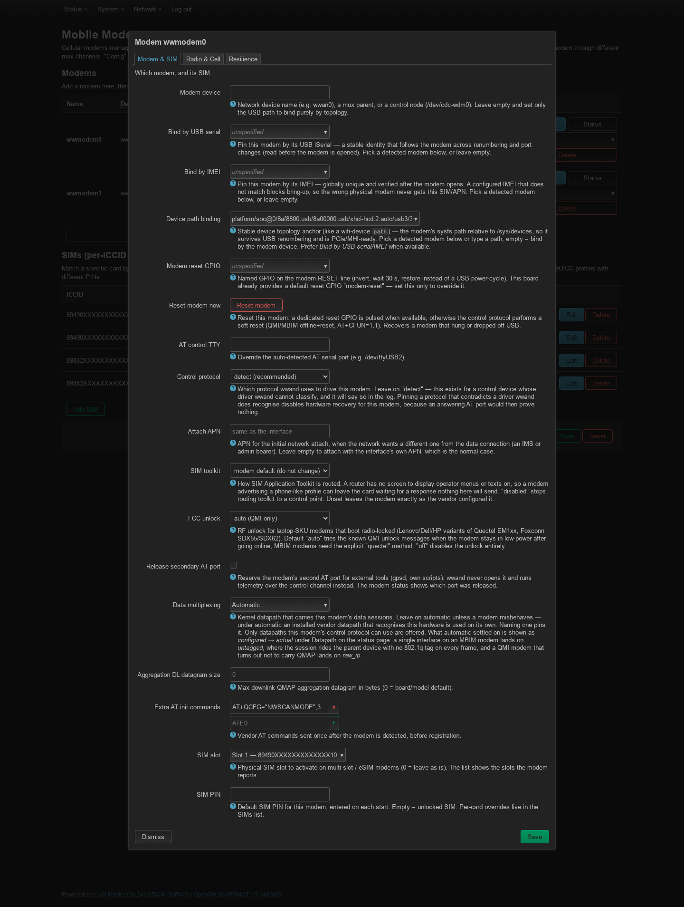

## Interface config (Network → Interfaces)

Editing a `proto Cellular / 5G (wwand)` interface: live modem status, the
**Modem** selector (which `wwand_modem` this connection runs on), the APN /
PDP / auth, and the stable **L3 device** name (`wwand0…wwand100`, auto-assigned
and written back). Extra tabs cover Connection, Modem & SIM, Radio & Cell,
Resilience.

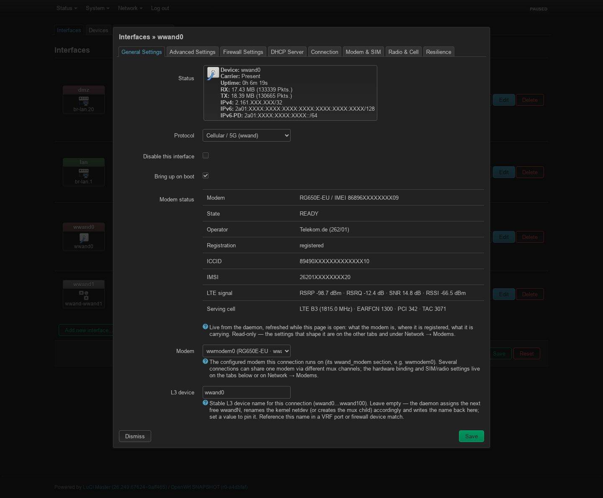

The **Connection** tab holds the data-bearer settings: APN, PDP type and auth,
the QMAP **mux channel** that lets several connections share one modem, the
3GPP **attach profile index**, MTU handling and the reconnect behaviour.

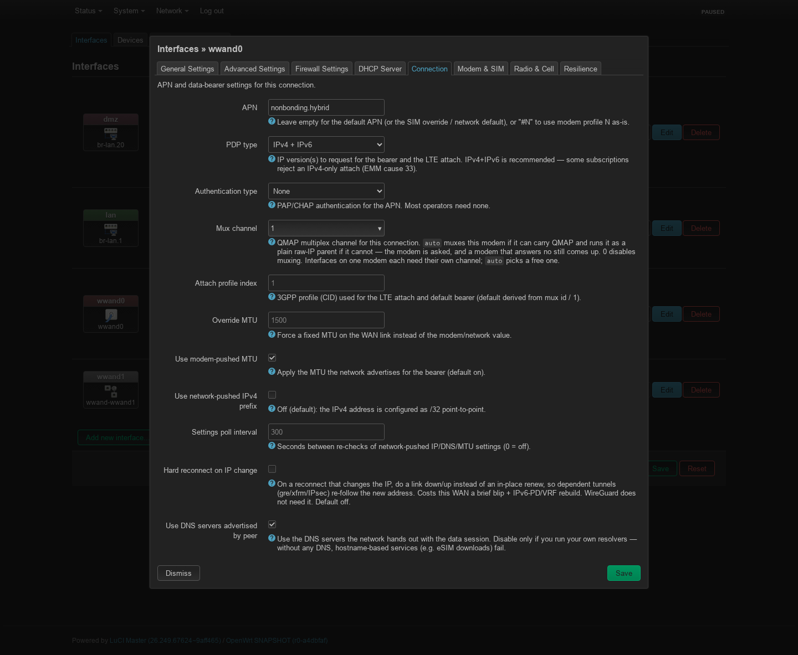

Note that `ip6ifaceid` — pinning the IPv6 interface identifier against a carrier
that rotates it — is *not* on this tab. It is netifd's own option and LuCI
claims it for every protocol as the **IPv6 suffix** box under *Advanced
Settings*; see [reference.md](reference.md).

## Per-SIM override editor (SIM / APN / PIN)

Match a specific card by its ICCID and give it a PIN — and optionally its own
APN / auth / PDP type, optionally bound to one modem. Ideal for dual-SIM or
swapping eUICC profiles with different PINs.

A **Name** ("Work", "Travel") labels the card; it is shown on the SIM cards page
and in the modem status slot cards, and renaming the card in use changes nothing
on the connection.

The table's **Now** column says where each card is at the moment, from the SIM
inventory: modem and slot, `eSIM <state>` for an eUICC profile, `rsim <reader>`
for a card in a remote reader, `in use` for the one a modem runs on, or *not
present* / *not seen*. Status only; the PIN column shows only whether a PIN is
set.

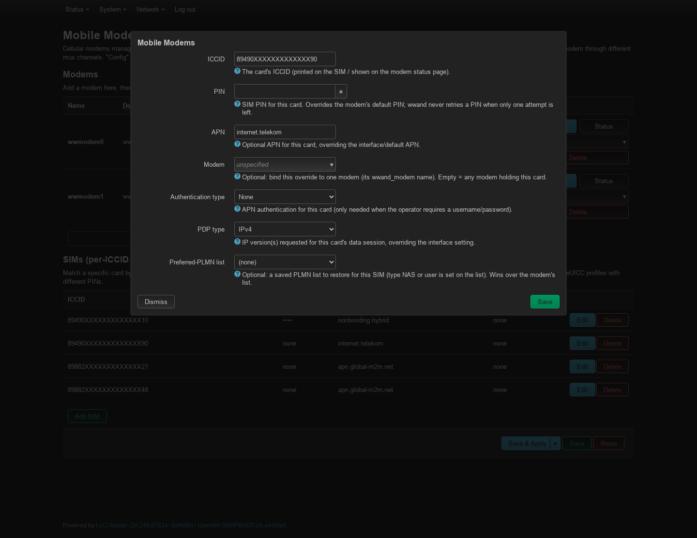

## Status → SIM cards — the inventory

Every card wwand has seen, by ICCID, and where it is: a modem and slot, a
profile on an eUICC, or a reader (remote SIM). A card that was taken out stays
listed as *not present*, with when it was last seen; the cards in a
multi-slot modem's inactive slots appear once its slot list has been read.
`wwandctl sims` prints the same.

Each row has **Edit** or **Create**: it opens the card's per-SIM override (PIN,
APN, …) in the editor on the Modems page — the card's entry when it has one
(matched by ICCID, or by IMSI as the daemon matches), otherwise a new one with
the ICCID filled in, kept only by Save & Apply. The Modems page takes the card
as `?sim=<ICCID>`.

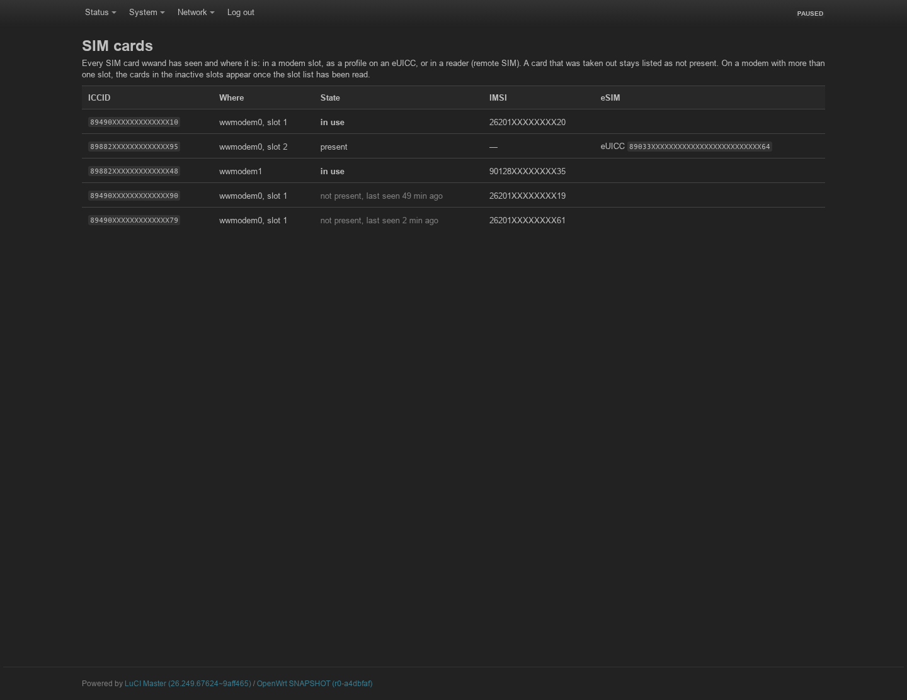

## Modem Tools — bands, operator, cell lock, SIM, eSIM, SMS

Radio-technology and per-band selection, manual/automatic **network
selection** with an operator scan, **cell lock**, SIM slot & PIN control, full
**eSIM profile management** (download via activation code through lpac,
enable/disable/delete, provider confirmations), SIM PLMN preference lists and
SMS.

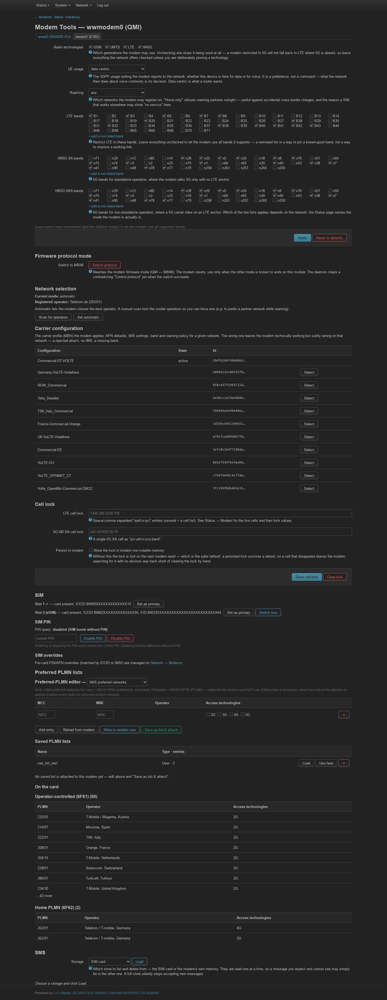

## Modem status

Configuration warnings first, then **live signal graphs**, then the panels:
modem identity, serving cell, SIM slots, the active connection (IP/DNS/MTU,
uptime, data), datapath and muxing, carrier aggregation and neighbour cells.
Refreshes about once a second.

The active slot's card shows ICCID, IMSI, PIN state and, for an eUICC, what
its ISD-R says about itself: **eUICC** (SGP.32 IoT or SGP.22, with the SGP.22
version) and **IPA** — in the card (IPAe) or on the device (IPAd). A card run
by its own IPA keeps its profiles to itself (ES10 is closed to the router), so
the panel says so instead of trying to read the list. The Recovery row says
when the card-resetting steps are held after such a card changed profile.

The graphs keep the last few minutes **in the browser** — nothing is stored on
the router, so the window starts empty and a reload clears it. That is the job
they are for: watching what turning an antenna does, while turning it.

Each canvas carries **one quantity** with its own quality thresholds, and one
**series per radio technology** rather than a single line that quietly changes
meaning when the modem switches: on EN-DC the LTE anchor and the NR carrier
arrive in the same reply and can differ by 10 dB, and a gap in the 5G line is
itself the information that 5G stopped serving. Solid lines are the serving
cell's own power (RSRP, or RSCP on 3G); dashed lines are the band-wide RSSI in
the same colour, and an RSSI keeps the RAT that measured it — only a modem
reporting an untagged value gets the plain amber line.

A canvas and its legend rows **appear with their data**: an LTE-only modem
never shows the 3G Ec/Io graph, and a 2G-camped one shows nothing but its RSSI.
The thresholds come from the published vendor tables (and match the ladder the
router's own signal LEDs step at) — hover a heading or its legend for the
sources and the caveats.

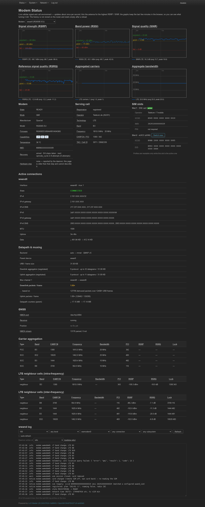

The **Modem** selector above the graphs appears once a box has more than one
configured modem; each keeps its own history, so switching back to one shows
the window it had rather than starting over.

A Zyxel NR7101 on **5G NSA** — both radios report at once, so every canvas
carries an LTE line and a 5G line, and a break in the purple one is 5G dropping
out rather than a missing reading:

## Network → Remote SIM (plugin: wwand-rsim)

With the [wwand-rsim](https://github.com/ddimension/wwand-rsim) plugin a
modem can run on a SIM card that is not in its own slot: in a reader on the
router or on a PC, in a phone lent over Bluetooth (SIM Access Profile), in
another modem of the same router, or in a modem of another wwand router. What
has run on which hardware, and the workarounds for it, is in that repository's
README, *What works*.

**Status** — per modem the card in use and the remote SIM behind it, and whom
it lends its own card to. Here the Chateau's RG650E runs on the card of the
Huawei E392 next to it; the E392 lends it APDU by APDU (it hangs on SIM
Access) with its radio off:

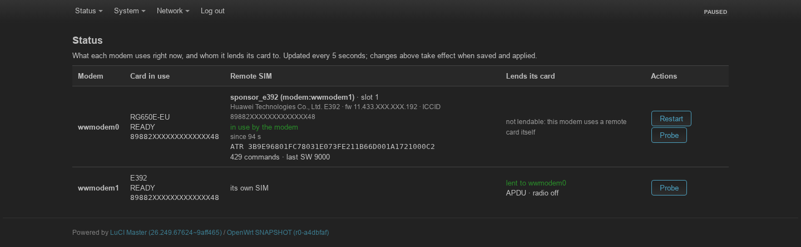

**Find SIM sources** — a scan of this router or, over SSH, of another
machine. Nothing is sent to a card or a port, and a phone is not called up.
A PC with a Smartmouse USB reader and two paired phones that offer SIM Access,
with what sysfs and BlueZ know about each:

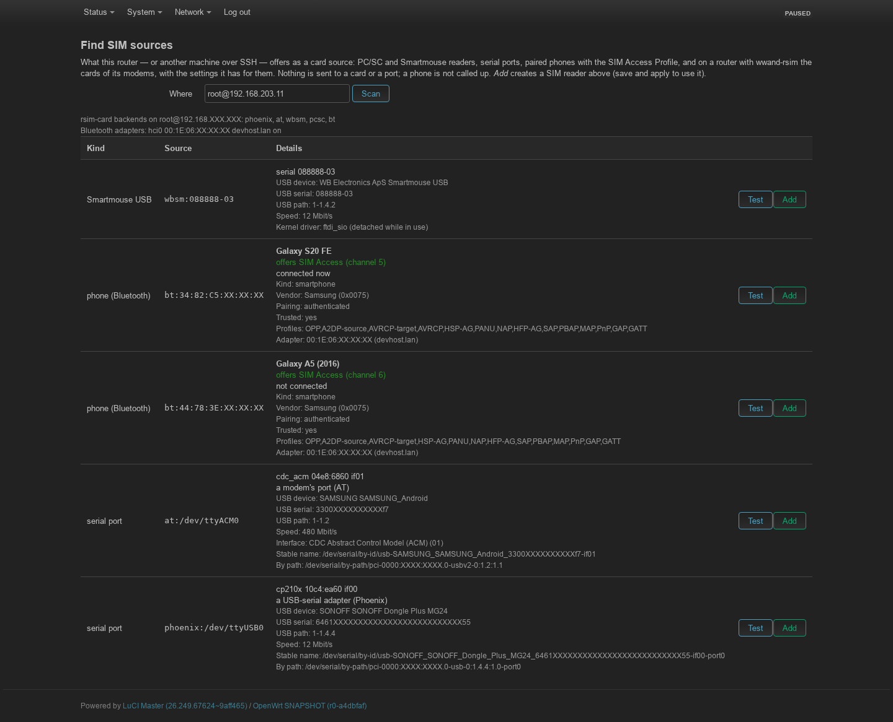

...and another wwand router: its modem's ports (the one wwand drives and the
diagnostic port are not offered), and the card in its modem with the settings
that router dials it with — which come along as this router's `wwand_sim` for
the card when it is borrowed:

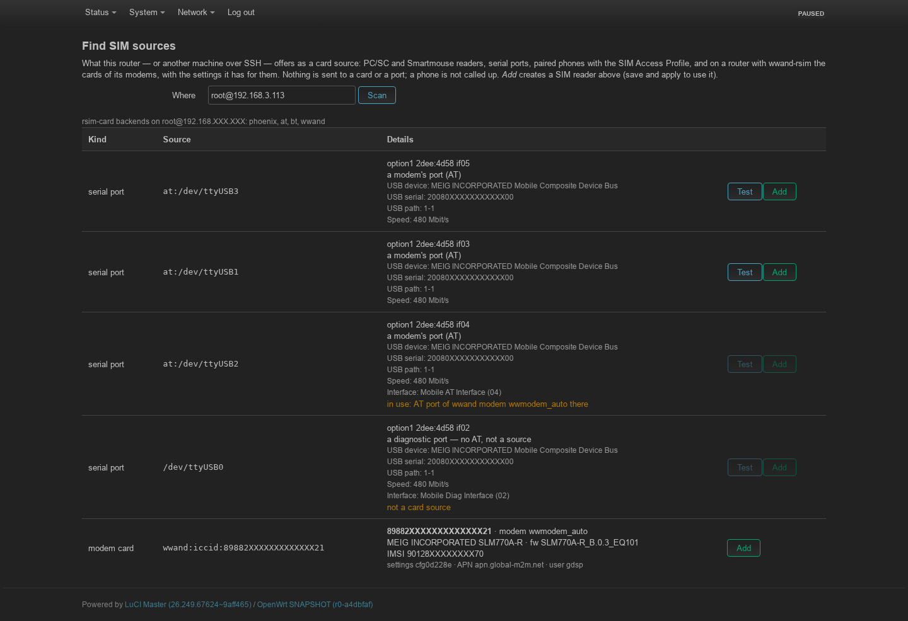

**SSH setup** — the router's key, and per machine the `authorized_keys` line
that lets it run only what wwand-rsim needs there (`rsim-card --serve`, the
readers named), with a *Test* that says what is wrong:

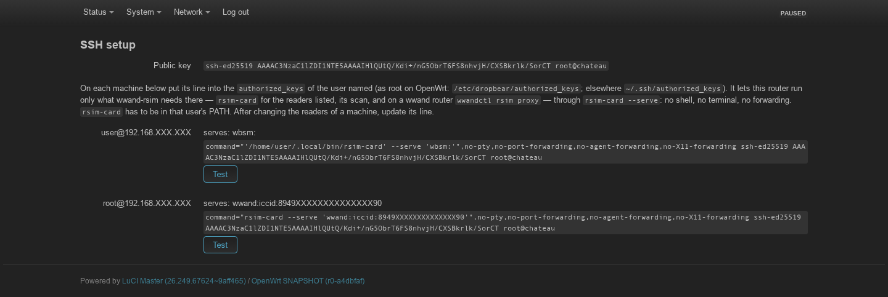

**SIM readers** and **Modems** — the configuration: where cards come from,
and which one each modem uses (*its own SIM* gives its card back at once):

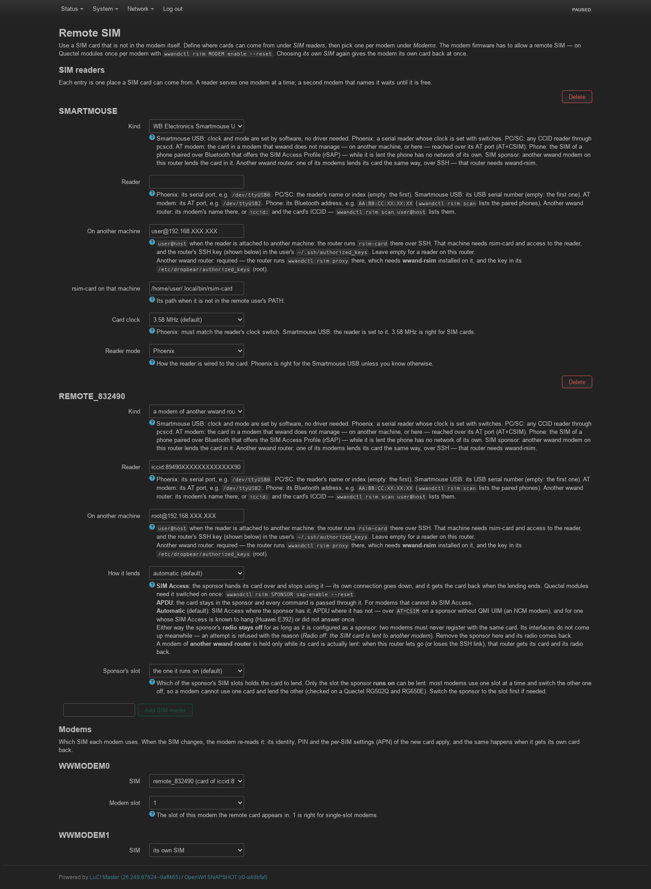

The modem status page shows the remote SIM in the modem panel:

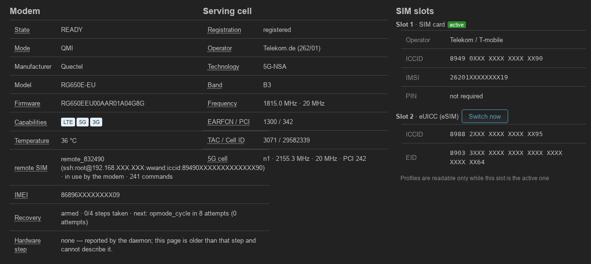
